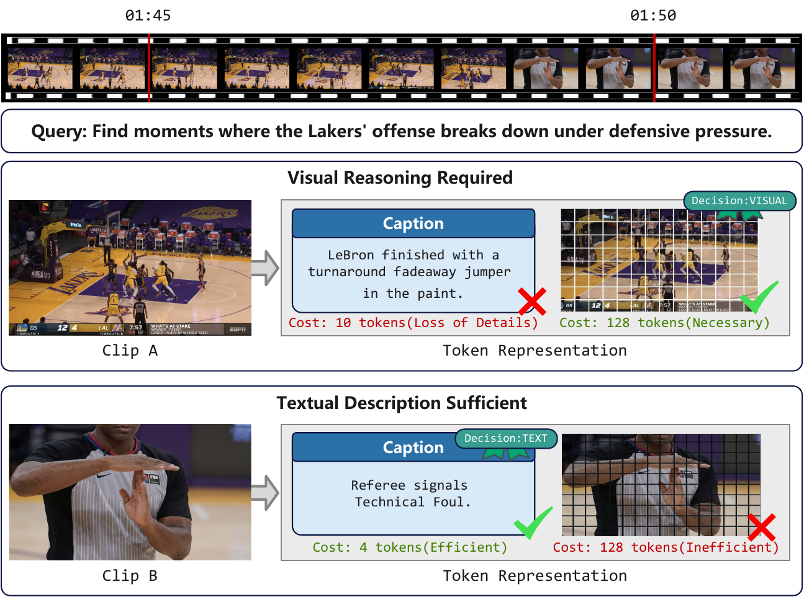
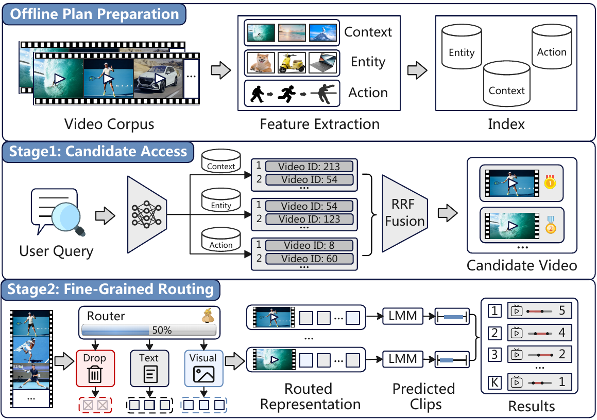

<div align="center">

# 🎬 ClipPlan

**Budget-Aware Multimodal Video Query Processing**

Retrieve and globally rank temporal clips from large video corpora under a shared multimodal token budget.

[](https://www.python.org/)
[](LICENSE)
[](https://cloud.baidu.com/product-s/qianfan_home)

</div>

## ✨ Overview

ClipPlan builds context, entity, and action indices, retrieves a compact candidate pool with reciprocal-rank fusion, and uses a learned `DROP / TEXT / VISUAL` router before Qianfan-based temporal localization and relevance scoring.

The repository contains source code and configuration only. It does not include datasets, model weights, retrieval indices, API credentials, checkpoints, caches, logs, or paper results.

<p align="center">
  
  <br>
  <em>ClipPlan selects the appropriate processing mode for each video-query pair.</em>
</p>

## 🔄 Pipeline

<p align="center">
  
</p>

1. Normalize query and temporal relevance annotations.
2. Extract frames at the paper default interval of 2 seconds.
3. Build context, entity, and action HNSW indices.
4. Fuse the three rankings with RRF and retain the top 60 videos.
5. Train the Qwen3-VL router with counterfactual PPO.
6. Route frames under 40% of Full-Visual input tokens.
7. Use ERNIE through Qianfan to localize clips and assign relevance scores.
8. Evaluate the globally ranked clips with temporal NDCG.

## 📦 Installation

Python 3.10 or newer is required. Install ffmpeg separately when using the frame extraction utility.

```bash
python -m venv .venv
source .venv/bin/activate
pip install -e .
```

For development and tests:

```bash
pip install -e '.[dev]'
```

## 🤖 Models

Download the default router and CLIP checkpoints:

```bash
bash scripts/download_models.sh
```

Set `DOWNLOAD_OPTIONAL_MODELS=1` to also download the optional BLIP-2 and SAM2 checkpoints. See [models/README.md](models/README.md) for the expected paths. A local ERNIE checkpoint is not required because scoring uses Qianfan.

## 🗂️ Data layout

ClipPlan expects each prepared dataset to contain annotations, sampled frames, and frame captions:

```text
data/qvh/
├── annotations/
│   └── train_router_pool_h60_ndcg10.json
├── frames/
│   └── VIDEO_NAME/
│       ├── 000001.jpg
│       └── ...
└── captions.jsonl
```

A normalized query record has this minimal shape:

```json
{
  "query_id": "42",
  "query": "A person opens a cabinet.",
  "ground_truth": [
    {"video_name": "video_001", "start": 12.0, "end": 18.0, "relevance": 3}
  ]
}
```

Normalize an existing JSON or JSONL annotation file:

```bash
clipplan-prepare \
  --input data/raw/annotations.json \
  --output data/qvh/annotations/train.json
```

Extract frames from one video at the paper default interval:

```bash
python -m clipplan.data.extract_frames \
  --video data/raw/video.mp4 \
  --output-dir data/qvh/frames/video_001 \
  --interval 2
```

## 🔎 Candidate retrieval

Entity proposals are generated offline. The accepted SAM2 proposal schemas are documented in `clipplan.retrieval.proposals.EntityProposalStore`. Boxes below 0.5% or above 80% of frame area are discarded, and at most eight regions are retained per frame. The included action index uses mean-pooled CLIP frame windows as a portable temporal approximation; reproducing the paper exactly requires replacing that encoder with the experiment's pretrained CLIP4Clip-style checkpoint.

Build the three HNSW indices:

```bash
DATASET_ROOT=data/qvh \
INDEX_DIR=indices/qvh \
ENTITY_PROPOSALS=data/qvh/sam2_proposals.json \
bash scripts/build_retrieval_index.sh
```

Retrieve and fuse candidates with `kappa=60` and `H=60`:

```bash
INDEX_DIR=indices/qvh \
ANNOTATION_PATH=data/qvh/annotations/test.json \
OUTPUT_PATH=data/qvh/annotations/test_router_pool_h60_ndcg10.json \
bash scripts/retrieve_candidates.sh
```

## 🔑 Qianfan configuration

Copy the environment template and provide your own credential. Never commit the resulting `.env` file.

```bash
cp .env.example .env
export QIANFAN_API_KEY='YOUR_KEY'
export QIANFAN_APP_ID='YOUR_APP_ID'  # optional
```

The default endpoint is `https://qianfan.baidubce.com/v2/chat/completions`, and the default model is `ernie-4.5-turbo-vl-32k`. Both can be overridden with `QIANFAN_API_BASE_URL` and `QIANFAN_API_MODEL`.

## 🧠 Router training

The training entry point consumes [configs/router_train.yaml](configs/router_train.yaml) directly. The configuration separates constants stated in the paper from explicit implementation defaults needed to run training:

| Setting | Value | Source |
|---|---:|---|
| Actor | Qwen3-VL-2B-Instruct | Paper |
| Actions | DROP, TEXT, VISUAL | Paper |
| Candidate pool | 60 videos | Paper |
| Global online budget | 40% of Full-Visual input tokens | Paper |
| Optimizer | AdamW | Implementation default |
| Actor learning rate | 1e-6 | Implementation default |
| Critic learning rate | 1e-4 | Implementation default |
| Critic | 22 -> 128 -> 128 -> 3, SiLU | Implementation default |
| PPO clipping epsilon | 0.2 | Paper |
| Counterfactual selection rate | 0.12 | Paper |
| Continuations per feasible action | 1 | Paper |
| Training steps | 1000 | Implementation default |

Start single-process training:

```bash
QIANFAN_API_KEY='YOUR_KEY' bash scripts/train_router.sh
```

Set `NUM_PROCESSES` for distributed training. Hardware-dependent batch size and accumulation settings remain configurable rather than being treated as method constants. The router enforces one query-level budget shared by all candidates. Its configurable TEXT and VISUAL costs are token-cost estimates; calibrate them from the deployed Qianfan serialization and usage accounting for exact service-side token measurements.

A no-model dry run validates data loading and prints the effective setup:

```bash
clipplan-train --config configs/router_train.yaml --dry-run
```

## 🚀 Inference

Run greedy router inference and Qianfan scoring:

```bash
QIANFAN_API_KEY='YOUR_KEY' \
DATASET_ROOT=data/qvh \
ANNOTATION_PATH=data/qvh/annotations/test_router_pool_h60_ndcg10.json \
OUTPUT_PATH=outputs/qvh_predictions.jsonl \
bash scripts/run_inference.sh
```

The output contains router decisions, predicted temporal clips, relevance scores, NDCG, and cache metadata for each query.

## 📊 Evaluation

The default paper metric is NDCG@10 with temporal IoU threshold 0.5:

```bash
PREDICTIONS=outputs/qvh_predictions.jsonl \
ANNOTATIONS=data/qvh/annotations/test.json \
bash scripts/evaluate.sh
```

Use `--k` and `--iou-threshold` to reproduce NDCG@5/10/20 and IoU thresholds 0.3/0.5/0.7.

## 📁 Repository scope

The repository deliberately excludes historical two-action GRPO experiments, unrelated task code, complete LlamaFactory or verl source trees, internal service endpoints, and system-specific launch scripts. The released training path is the three-action counterfactual PPO method used by ClipPlan.

## 🔐 Security

Never commit `.env`, API credentials, Qianfan access tokens, model checkpoints, datasets, caches, or experiment outputs. The provided `.gitignore` excludes their standard locations. Revoke and rotate a credential immediately if it is ever committed or shared outside its intended environment.

## 📄 License

ClipPlan is released under the MIT License. See [LICENSE](LICENSE).
